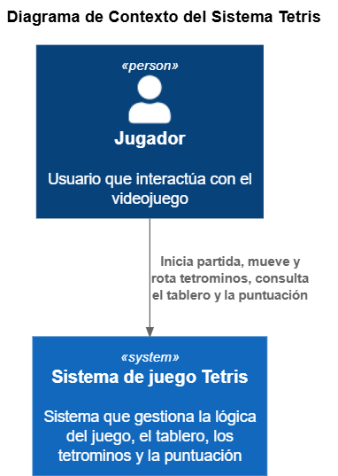
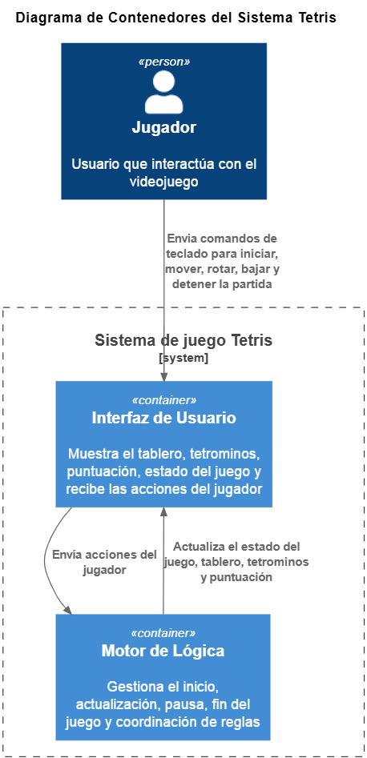
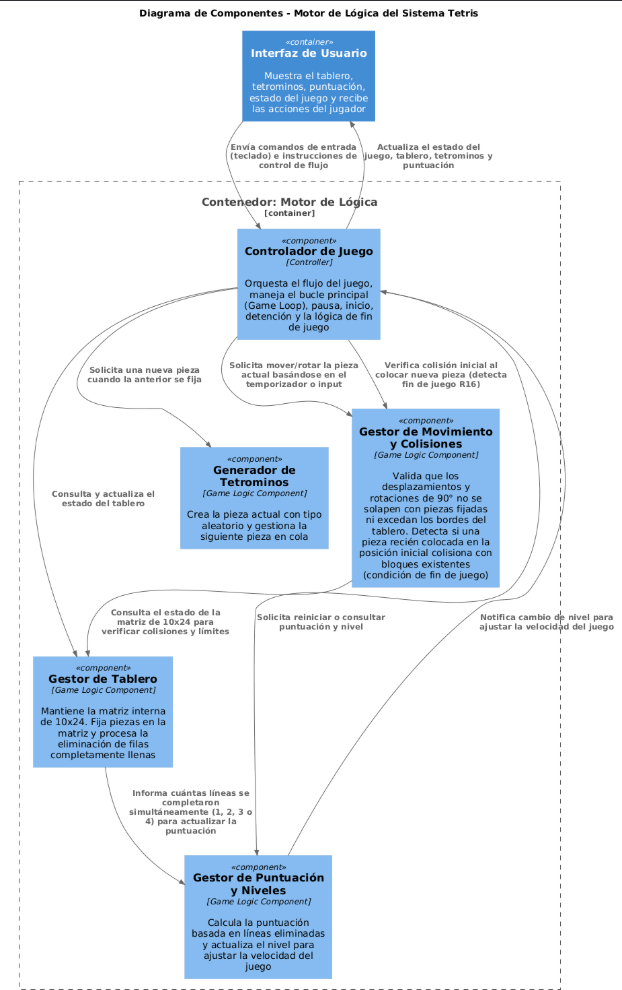
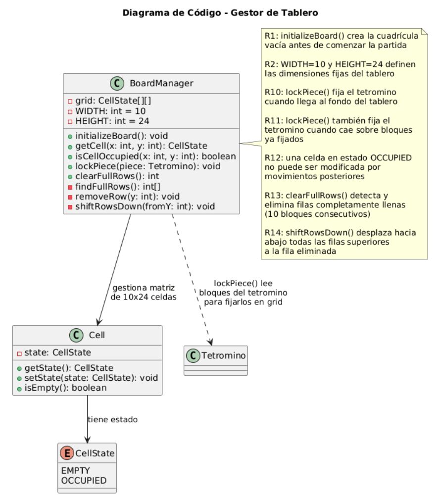
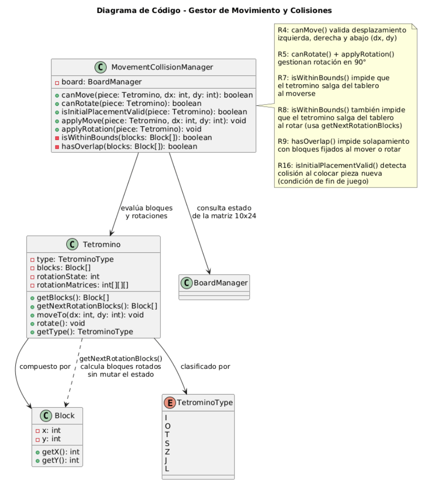
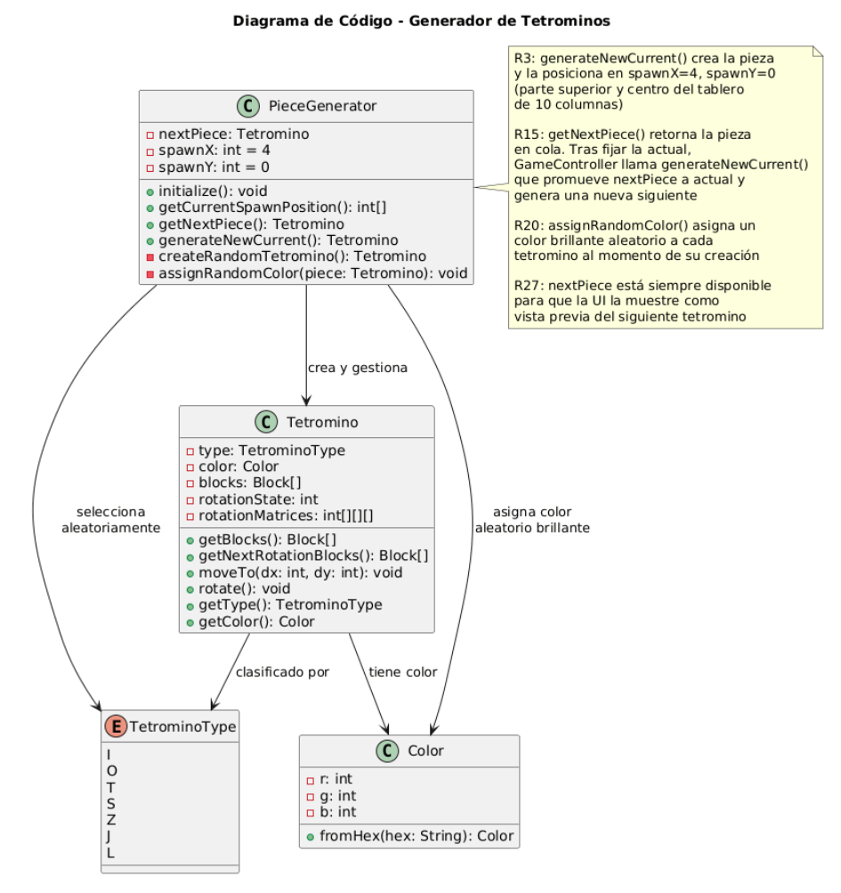

# C4 aplicado a ejercicio de Tetris

## Grupo 3
Integrantes:
- Mateo Calvache
- Julián Camacho
- Mateo Simbaña
- Alexis Villareal
- Mateo Yunga

## Índice
- [Diagrama de contexto](#diagrama-de-contexto)
- [Diagrama de contenedor](#diagrama-de-contenedor)
- [Diagrama de componentes](#diagrama-de-componentes)
- [Diagramas de códigos](#diagramas-de-c%C3%B3digos)
	- [Gestor de Tablero](#gestor-de-tablero)
	- [Gestor de movimientos y Colisiones](#gestor-de-movimientos-y-colisiones)
	- [Generador de Tetrominos](#generador-de-tetrominos)

## Diagrama de contexto

	

## Diagrama de contenedor

	

## Diagrama de componentes

	

## Diagramas de códigos

### Gestor de Tablero

	

### Gestor de movimientos y Colisiones

	

### Generador de Tetrominos

	

